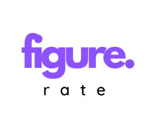

<div style="display:flex; flex-direction: column; align-items: center;">
  
  <p style="margin-top: 15px; font-size: 17px;">🔍 Comparing interest rates from Fiji's financial institutions made easy! 👌</p>
  <div style="display: flex; justify-content: center;">
    =_10.2.4-blue" width="105" height="20" alt="npm version" style="margin-right: 10px;" />
    =_20.11.1-dark_green" width="105" height="20" alt="Node.js version" />
  </div>
</div>

## 🎯What do we do

> Figure Rate is a service & tool that compares interest rates from different financial institutions in Fiji.

## 📸 Preview


## 🔨 Built With

- React
- TypeScript
- JavaScript
- Bootstrap

## 💻 Live Demo

<a href="https://raw.githack.com/chelmerrox/figure/development/index.html">Figure Rate</a>

## ⌨️ Getting Started

To get a local copy up and running follow the simple steps outlined below.

## 🔧 How To Use

From your command line, do the folowing steps below:
​

1. Clone the projects' repository into your machine.

```bash
# Clone this repository
$ git clone git@github.com:chelmerrox/figure.git

```

2. Change directory/Go into the repository with the command below.

```bash
$ cd figure/

```

3. Change directory into figure-rate.

```bash
$ cd figure-rate/

```

4. Run the command below to view the site on your local machine.

```bash
$ npm run dev

```

## ✍️ Author

👩‍💻 **Losalini Rokocakau** • [GitHub](https://github.com/chelmerrox) • [X](https://twitter.com/chelmerrox) • [LinkedIn](https://www.linkedin.com/in/losalini-rokocakau)

## 🤝 Collaborator(s)

👨‍💻 **Senitiki Rokocakau** • [GitHub](https://github.com/senitiki) • [X](https://twitter.com/senitiki) • [LinkedIn](https://www.linkedin.com/in/senitiki-rokocakau)

## 🙏 Show your support

Give a ⭐️ if you like this project!

## 👨‍👩‍👧‍👦 Acknowledgments

- Our God, the Lord Jesus Christ & the Holy Spirit.
- Family & friends
- Mentors
- Other colleagues
- Any others not mentioned here

## ©️ License

This is a copyrighted material for Aver Pte Limited. ©️ 2024 All rights reserved.
